# Projeto Django - Desafio Rock

### Descrição do Projeto

- A plataforma Rock Challenge foi desenvolvida para atender às necessidades do usuário no gerenciamento financeiro, especialmente focado em investimentos no mercado imobiliário. A plataforma oferece os seguintes recursos:

Este projeto foi desenvolvido em Python, utilizando o framework Django.
###### Utilizado as seguintes tecnologias:
    -    Python(Framework - Django)
    -    HTML
    -    CSS (Framework - Bootstrap)
    -    JavaScript
    -    SQL (sqlite3)
    -    IDE (VSCode)
    
- O Sistema pode ser integrado com o MySQL Workbench, por exemplo, realizando as seguintes modificações:
  ###### No arquivo settings.py da aplicação, em DATABASES:
  ###### Altere isso:
      DATABASES = {
            'default': {
                'ENGINE': 'django.db.backends.sqlite3',
                'NAME': BASE_DIR / 'db.sqlite3',
            }
      }
  
  ###### Por isso:
  ###### Lembrando que é necessário realizar a criação do banco de dados para que o mesmo possa ser encontrado para realizar a criação das tabelas:
        DATABASES = {
            'default': {
                'ENGINE': 'django.db.backends.mysql',
                'NAME': 'seu_banco_de_dados',
                'USER': 'seu_usuario',
                'PASSWORD': 'sua_senha',
                'HOST': 'localhost',
                'PORT': '3306',
            }
        }

###### Imagens do Projeto:
| 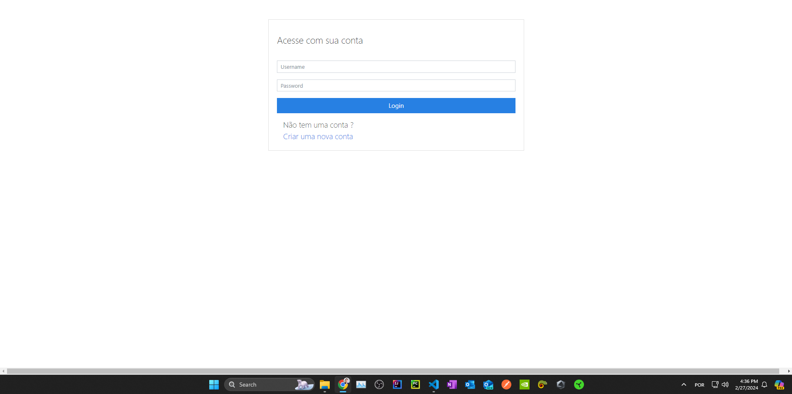 | 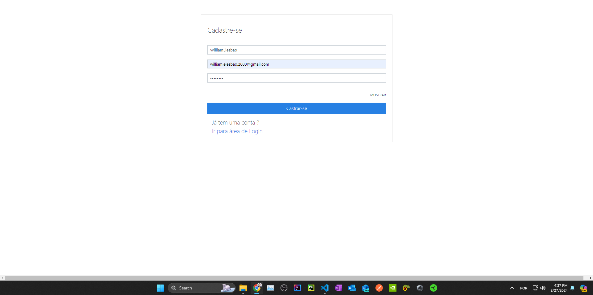 | 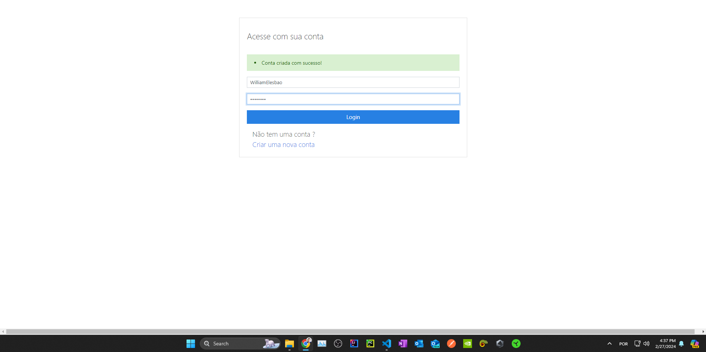 |
|-----|-----|-----|
| 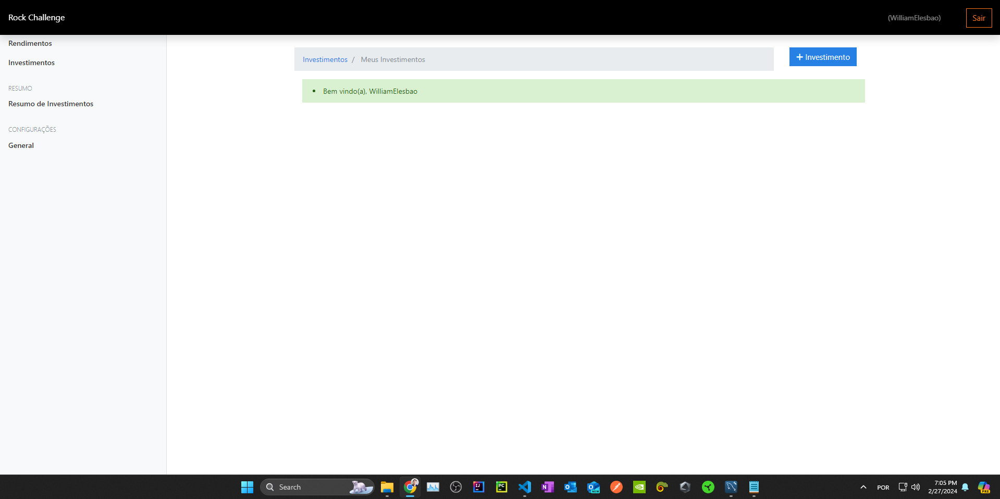 | 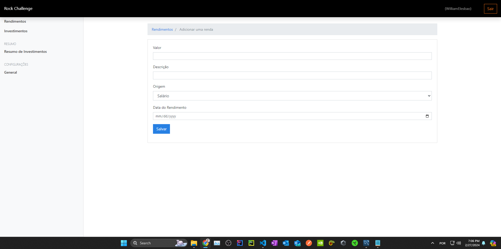 | 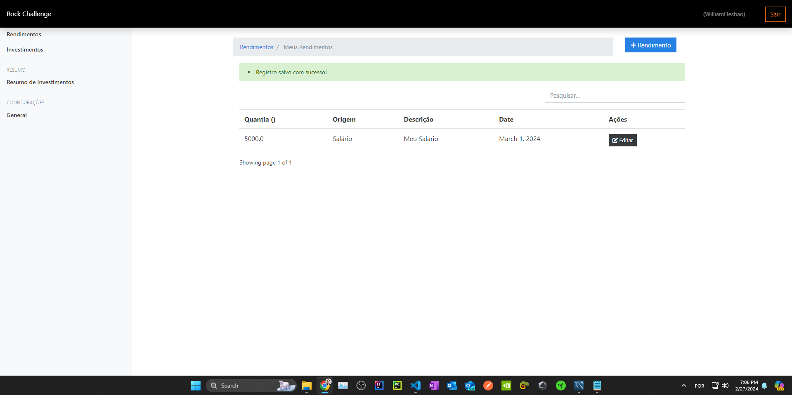 
| 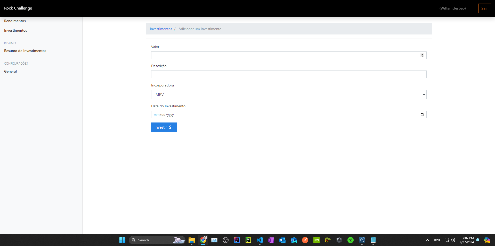 | 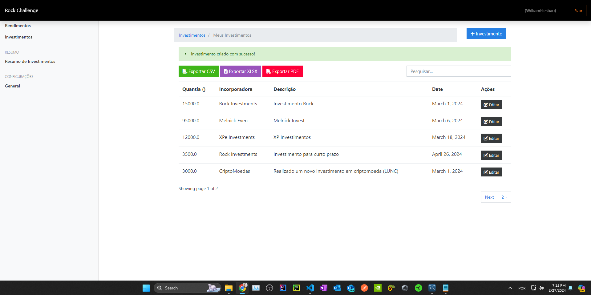 | 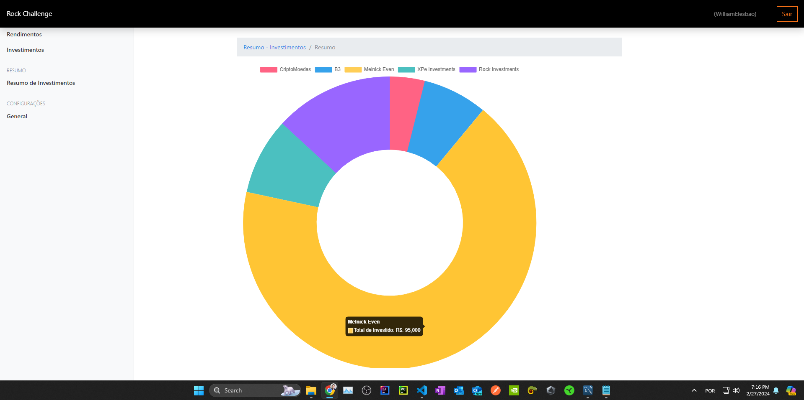

1. ##### Adicionar Rendimentos:

    - Os usuários podem registrar e acompanhar seus rendimentos, proporcionando uma visão abrangente de suas fontes de receita.

2. ##### Adicionar Investimentos:

    - A plataforma permite que os usuários registrem e monitorem seus investimentos no mercado imobiliário, fornecendo informações detalhadas sobre cada investimento.

3. ##### Escolher Moeda de Preferência:

    - Os usuários têm a flexibilidade de escolher sua moeda de preferência entre USD (Dólar Americano), BRL (Real Brasileiro) ou BTC (Bitcoin). Isso possibilita uma experiência personalizada conforme a preferência do usuário.

4. ##### Gráficos Analíticos:

    - A plataforma oferece recursos visuais, como gráficos, para análise rápida e intuitiva. Um gráfico específico destaca as principais incorporadoras associadas aos investimentos do usuário, proporcionando uma compreensão clara das principais fontes de investimento.

#### Endpoints/URLs e Métodos
1. ##### Endpoint de Rendimentos:

    -   URL: /income/
    -   Métodos:
        - GET: Retorna informações sobre os rendimentos do usuário.
        - POST: Adiciona um novo rendimento à conta do usuário.

2. ##### Endpoint de Investimentos:

    -   URL: /investments/
    -   Métodos:
        - GET: Retorna informações sobre os investimentos do usuário.
        - POST: Adiciona um novo investimento à carteira do usuário.

3. ##### Endpoint de Preferências do Usuário:

    - URL: /user/preferences/
    - Métodos:
        - GET: Retorna as preferências do usuário.
        - POST: Atualiza as preferências do usuário.

#### Tomadas de Decisão Relevantes

1. ##### Modelagem de Dados:

    - Optei por uma estrutura de modelo flexível para lidar com diferentes tipos de investimentos e rendimentos.

2. #####  Moeda de Preferência:

    - Implementei a capacidade de escolha da moeda para oferecer uma experiência personalizada aos usuários.

3. ##### Visualizações Analíticas:

    - Utilizei gráficos para fornecer análises visuais sobre as principais incorporadoras associadas aos investimentos dos usuários.

#### Rodando o projeto Localmente
##### Clonar o Repositório:
    git clone https://github.com/WilliamElesbao/Python-Rock-Challenge-2024.git

##### Acessa a pasta do projeto        
    cd Python-Rock-Challenge-2024

##### Crie um ambiente virtual para instalar as dependências:
    python -m venv nome_do_seu_ambiente_virtual

##### Caso esteja usando o terminal Bash, utilize o seguinte comando para ativar seu ambiente virtual:
    source nome_do_seu_ambiente_virtual/Scripts/Activate

##### Instalar Dependências:
    pip install -r requirements.txt

##### Acesse o diretório do Projeto para poder usar o manager.py.

##### Configurar Banco de Dados:
    python manage.py migrate

##### Criar Superusuário:
    python manage.py createsuperuser
    
##### Executar o Servidor de Desenvolvimento:
    python manage.py runserver

- Interface administrativa em http://127.0.0.1:8000/admin/
    - Acesse a interface administrativa com o super usuário que você criou.
    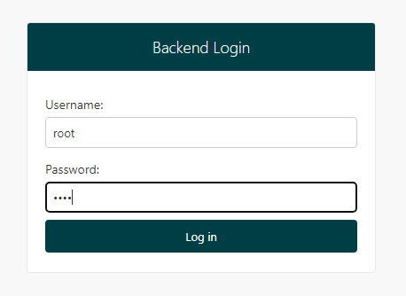
    -  Necessário criar as "categorias" ou "incorporadoras" pela interface adiministrativa.
    - Clique no botão "Add" para acessar a pagina para adicionar uma nova categoria.
    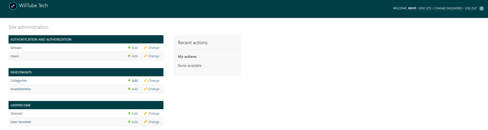
    - Crie e Salve sua nova categoria.
    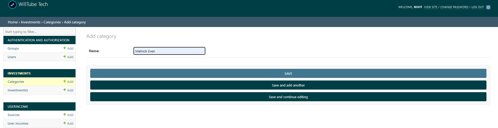
    - Após concluído os passos anteriores, deslogue da sessão admin no botão "Logout", no canto superior direito.
    - Após isso podes seguir para a URL da aplicação.

- Acesse a aplicação em: http://127.0.0.1:8000/
    -   Caso não tenha uma conta, clique em "Criar uma conta nova". Preenchido os campos de criação de uma nova conta, você será redirecionado para a tela de login, basta fazer o login para acessar o sistema.

#### Features Adicionais

1. ##### Escolha da Moeda:

    - Adição da funcionalidade para que os usuários possam escolher entre USD, BRL ou BTC como a moeda principal para seus registros financeiros.

2. ##### Gráficos Analíticos:

    - Implementação de gráficos interativos para análise visual rápida, destacando as principais incorporadoras associadas aos investimentos do usuário.

#### Referências
- [Django](https://www.djangoproject.com/)
- [The messages framework](https://docs.djangoproject.com/en/5.0/ref/contrib/messages/)
- [Template Idea](https://www.youtube.com/watch?v=n5bEi7QslcY)
- [Export to CSV | XLSX | PDF](https://www.youtube.com/@crycetruly)
- [AsimovAcademy](https://www.youtube.com/@AsimovAcademy)
- [Weasyprint](https://doc.courtbouillon.org/weasyprint/stable/first_steps.html#troubleshooting)
- [Python Org](https://www.python.org/)
- [xlwt](https://xlwt.readthedocs.io/en/latest/installation.html)
- [Python Org - xlwt](https://pypi.org/project/xlwt/)
- [Bootstrap](https://getbootstrap.com/)
- [Bootswatch](https://bootswatch.com/)
- [Font-Awesome - cdn](https://cdnjs.com/libraries/font-awesome)
